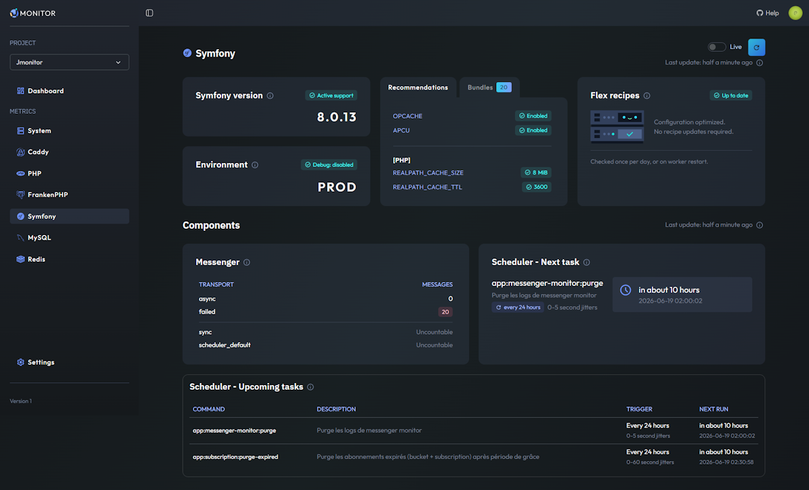

# Jmonitor

### Simple monitoring for PHP & Symfony stacks

Plug the collectors, get clear dashboards in minutes — without building and maintaining a Grafana/Prometheus stack.

[](https://packagist.org/packages/jmonitor/collector)
[](https://packagist.org/packages/jmonitor/jmonitor-bundle)
[](https://github.com/jmonitor/jmonitor-bundle/actions)
[](LICENSE)
[](https://github.com/jmonitor/jmonitor-bundle/commits)

[**https://jmonitor.io**](https://jmonitor.io)



## Why Jmonitor?

Grafana, Prometheus and Datadog are powerful, but they take time to configure and expertise to run. Jmonitor focuses on getting you readable dashboards fast, made for the PHP world.

- **Built for the PHP/Symfony ecosystem** — dedicated collectors for MySQL, Redis, Apache, Nginx, Caddy, PHP, FrankenPHP & PostgreSQL, plus a Symfony bundle for drop-in integration.
- **Readable out of the box** — premade dashboards (gauges + graphs) anyone on the team can understand, not just observability experts.
- **Lightweight to install** — a small PHP collector library running as a worker. No agent, no heavy infra to maintain.
- **Multi-project & team-ready** — manage several projects with role-based access (Owner / Admin / Member).

> Jmonitor monitors itself with Jmonitor.

---

# Jmonitor Bundle

This bundle is the integration of the [*jmonitor/collector*](https://github.com/jmonitor/collector) library into Symfony to collect metrics from your stack. 
It also provides a Symfony specific collector and a command to run the collectors in a long-lived worker process.

## Requirements
- PHP 8.1+ for this bundle. (The standalone collector library supports PHP 7.4.)
- Symfony 6.4+.

## Quick Start

1) Install the bundle:

```bash
composer require jmonitor/jmonitor-bundle
```

2) Create a project on https://jmonitor.io and copy your Project API key.
3) Configure your API key and collectors.


```dotenv
# .env
JMONITOR_API_KEY=
```

```dotenv
# .env.prod
JMONITOR_API_KEY=your_api_key
```

```yaml
# config/packages/jmonitor.yaml
jmonitor:
    # project_api_key can be empty to disable sending data to Jmonitor
    # useful for testing pourposes in non-production environments
    project_api_key: '%env(JMONITOR_API_KEY)%'

when@prod:
    jmonitor:
        # Optional (recommended): use a specific logger service (Symfony's default is "logger").
        # See "Debugging" section below for more informations.
        logger: 'logger'
    
        # Optional: provide a custom HTTP client service
        # http_client: 'http_client'
        
        # Enable the collectors you want to use (remove the unused ones).
        # Refer to the collector library for deeper collector-specific doc: https://github.com/jmonitor/collector
        collectors:
            # Cpu, Ram, Disk... Linux only.

            # You can use a RandomAdapter on Windows for testing purpose.
            # system:
            #     adapter: 'Jmonitor\\Collector\\System\\Adapter\\RandomAdapter'
            system: ~
            
            # Apache via mod_status module.
            # for more information, see https://github.com/jmonitor/collector?tab=readme-ov-file#apache
            apache:
                server_status_url: 'http://localhost/server-status'

            # Nginx via stub_status module.
            # for more information, see https://github.com/jmonitor/collector?tab=readme-ov-file#nginx
            nginx:
                endpoint: 'http://localhost/nginx_status'
            
            # MySQL - multiple sub-collectors available : status, variables, slow_queries, information_schema
            # all sub-collectors are enabled by default, disable some of them by setting them to false
            # Queries run through a Doctrine DBAL connection (default: doctrine.dbal.default_connection).
            # SlowQueries collector is configurable:
            # mysql:
            #     db_name: 'your_db_name'
            #     connection: 'doctrine.dbal.default_connection' # Doctrine DBAL connection service id
            #     slow_queries:
            #         limit: 5 # Maximum number of results to return (1-10)
            #         min_exec_count: 1 # Minimum number of executions required to include a query
            #         min_avg_time_ms: 0 # Minimum average execution time in ms for a query to be included.
            #         order_by: 'avg' # Allowed values: sum, avg, max
            mysql:
                db_name: 'your_db_name'

            # PostgreSQL - multiple sub-collectors available : activity, settings, database, slow_queries
            # all sub-collectors are enabled by default, disable some of them by setting them to false.
            # Queries run through a Doctrine DBAL connection (default: doctrine.dbal.default_connection).
            # The slow_queries sub-collector relies on the pg_stat_statements extension.
            # postgresql:
            #     connection: 'doctrine.dbal.default_connection' # Doctrine DBAL connection service id
            #     schema: 'public'                               # schema inspected by the database sub-collector
            #     slow_queries:
            #         limit: 5                  # Maximum number of results to return (1-10)
            #         min_exec_count: 1         # Minimum number of executions (calls) required to include a query
            #         min_avg_time_ms: 0        # Minimum mean execution time in ms for a query to be included
            #         order_by: 'avg'           # Allowed values: avg, total, max
            #         auto_create_extension: false # CREATE EXTENSION IF NOT EXISTS pg_stat_statements when missing
            postgresql:
                connection: 'doctrine.dbal.default_connection'

            # PHP : some ini keys, apcu, opcache, loaded extensions... 
            # /!\ See below for more informations about CLI vs Web-context metrics
            # CLI only:
            # php: ~
            # web metrics:
            php:
                endpoint: 'http://localhost/jmonitor/php-metrics'
            
            # symfony: some infos, loaded bundles, flex recipes, schedules...
            # Components are auto-detected based on installed packages.
            # You can disable a component by setting it to false, or configure it:
            # symfony:
            #     flex: false       # disable
            #     scheduler: false  # disable
            #     messenger: false  # disable
            #
            #     flex:
            #         command: "composer.phar recipes -o"  # default: "composer recipes -o"
            #         timeout: 10                          # default: 5 (seconds)
            #     Note: flex recipes are checked once per day and cached for the rest of the worker process lifetime.
            #
            #     messenger:
            #         command: "php bin/console messenger:stats --format=json"  # default: auto
            #         timeout: 5                                                # default: 3 (seconds)
            symfony: ~

            # Redis metrics via INFO command
            # you can use either DSN or a service name (adapter).
            # redis:
            #     dsn: '%env(SOME_REDIS_DSN)%'
            #     adapter: 'some_redis_service_name'
            redis:
                
            # Metrics from Caddy / FrankenPHP
            # see https://caddyserver.com/docs/metrics and https://frankenphp.dev/docs/metrics/
            caddy:
                endpoint: 'http://localhost:2019/metrics'
                frankenphp: true # default is false
```
4) Run a collection manually to verify. It may be easier to do this in the production environment, since configuring the bundle (or certain collectors) in development is not always possible.
```bash
php bin/console jmonitor:collect -vvv --dry-run
```

## PHP metrics: CLI vs Web context

- PHP settings and extensions can differ significantly between CLI and your web server context.
- If you want metrics that reflect your web runtime, you must expose a tiny HTTP endpoint that returns PHP metrics from within that web context.

To do that, create a route config file: 

```yaml
# config/routes/jmonitor.yaml
jmonitor_expose_php_metrics:
    path: '/jmonitor/php-metrics'
    controller: Jmonitor\JmonitorBundle\Controller\JmonitorPhpController

# Secured route in production with localhost host restriction
# Refer to symfony docs for more information about security
when@prod:
    jmonitor_expose_php_metrics:
        path: '/jmonitor/php-metrics'
        controller: Jmonitor\JmonitorBundle\Controller\JmonitorPhpController
        host: localhost
```

Set up a firewall for this route **before** the main firewall to prevent your app from interfering with it:
```yaml
# config/packages/security.yaml
security:
    firewalls:
        jmonitor:
            pattern: ^/jmonitor/php-metrics$
            security: false
            # instead of disabling security, you can use a stateless firewall if you plan to use ip security or something
            # stateless: true
        main:
        # ...
```

Wire it in your bundle config
```yaml
# config/packages/jmonitor.yaml
jmonitor:
    # ...
    collectors:
        php:
            endpoint: 'http://localhost/jmonitor/php-metrics'
```

## Running the collector

```bash
php bin/console jmonitor:collect [-vv|-vvv] [--dry-run]
```

This command runs as a long-lived worker: it periodically collects metrics from the enabled collectors and sends them to Jmonitor.io.

You can also limit how long it runs:
- `--memory-limit`: stop when the process memory usage exceeds the given limit (e.g. `128M`)
- `--time-limit`: stop after the given number of seconds

    ```bash
    php bin/console jmonitor:collect --vv --memory-limit=32M --time-limit=3600
    ```

You can pass a collector name as an argument to run only that collector — useful for debugging a specific integration:
```bash
php bin/console jmonitor:collect mysql -vvv --dry-run
```
In production, it is recommended to run this command under a process manager (e.g. Supervisor or systemd) to ensure it is kept running and restarted if necessary.
For practical guidance, you can follow Symfony Messenger's recommendations:
https://symfony.com/doc/current/messenger.html#deploying-to-production


## Logging and Debugging
- The command is resilient: individual collector failures do not crash the whole run; errors are logged (logging must be enabled in config).
- Symfony component collectors (flex, scheduler, messenger) that fail at worker startup are disabled for the lifetime of that worker process and an error is logged. Restart the worker to re-enable them.
- Log levels:
    - Errors (collector exceptions, HTTP responses with status >= 400): error
    - Collected metrics: debug
    - Summary: info

Useful commands:
```bash
# Verbose with debug logs
php bin/console jmonitor:collect -vvv

# Dry-run (collect but do not send)
php bin/console jmonitor:collect -vvv --dry-run

# Only summary
php bin/console jmonitor:collect -vv
```

## Troubleshooting

### Apache
> mod_status is enabled, but my endpoint is not reachable.

Don't forget to let the request pass through your index.php.  
For example, if you use .htaccess :
```
RewriteCond %{REQUEST_FILENAME} !-f
RewriteCond %{REQUEST_URI} !=/server-status    <---- add this
RewriteRule ^ %{ENV:BASE}/index.php [L]
```

---

Need help?
- Open an issue on this repo https://github.com/jmonitor/jmonitor-bundle/issues
- Open a discussion on https://github.com/orgs/jmonitor/discussions
